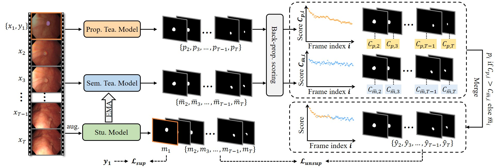
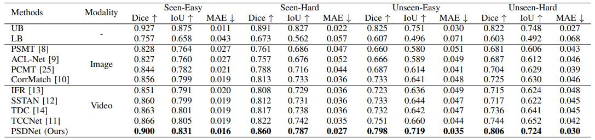
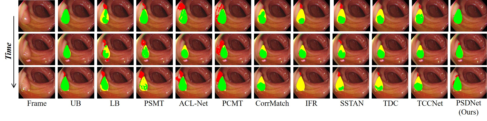

<h1>PSDNet</h1>
<h3>First-frame Supervised Video Polyp Segmentation via Propagative and Semantic Dual-teacher Network</h3>
 
<a href="https://scholar.google.com/citations?user=rU2JxLIAAAAJ&hl=en">Qiang Hu</a>1, Mei Liu2, Qiang Li1,&#8224;, <a href="https://scholar.google.com/citations?user=LwQcmgYAAAAJ&hl=en">Zhiwei Wang</a>1, &#8224;
 

1  WNLO, HUST,  2 HUST Tongji Medical College
 
(&#8224;: corresponding author)

## Overview
In this paper, we, for the first time, reduce the annotation cost to just ***a single frame*** per polyp video, regardless of the video's length. To this end, we introduce a new task, First-Frame Supervised Video Polyp Segmentation (FSVPS),
and propose a novel Propagative and Semantic Dual-Teacher Network (PSDNet). Specifically, PSDNet adopts a teacher-student framework but employs two distinct types of teachers: the propagative teacher and the semantic teacher. The propagative teacher is a universal object tracker that propagates the first-frame annotation to subsequent frames as pseudo labels. However, tracking errors may accumulate over time, gradually degrading the pseudo labels and misguiding the student model. To address this, we introduce the semantic teacher, an exponential moving average of the student model, which produces more stable and time-invariant pseudo labels. PSDNet merges the pseudo labels from both teachers using a carefully-designed back-propagation strategy. This strategy assesses the quality of the pseudo labels
by tracking them backward to the first frame. High-quality pseudo labels are more likely to spatially align with the firstframe annotation after this backward tracking, ensuring more accurate teacher-to-student knowledge transfer and improved segmentation performance. 

      

## Models
### SUN-SEG Video Polyp Segmentation (VPS)

| Model | Backbone | Seen-Easy (Dice) | Seen-Hard (Dice) | Unseen-Easy (Dice) | Unseen-Hard (Dice) | Weights |
| :---- | :------: | :------: |:--:| :---------------: | :-----: | :-: |
| PSDNet | [PVT](https://drive.google.com/file/d/1U77oKKK_qik2C0fd7hSKiYG43UA25GgD/view)  | 0.900 | 0.860 | 0.798 | 0.806 |  [ckpts](https://github.com/Huster-Hq/PSDNet/releases/download/untagged-9a1b35db60def0c15641/PSDNet.pth) |

## Performance on [SUN-SEG](https://github.com/GewelsJI/VPS)

### Quantitative Comparisons

      

### Qualitative Comparisons

      

## Acknowledgments
Thanks [XMem](https://github.com/hkchengrex/XMem) for the implementation of an efficient universal video object segmentaion, which is used as the propagative teacher model in this work.
